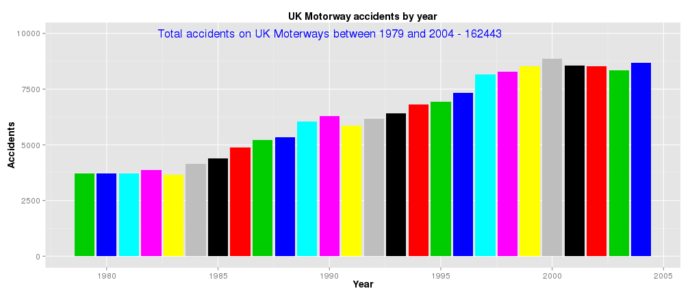
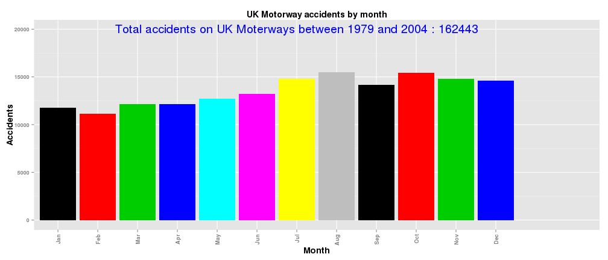

## Overview
As part of open data initiative UK government published data of off accidents happend in UK scince 1979 (link to data). This data set include 

1.Accident details (like date, locations, road etc)

2.Vehicle detaila (details of vechcles that are involved in accidents)

3.Casualities (Casuality details. If any)

Main objective of this application is to provide ability to drill down all accidents happend on motorways by Year, Motorway and month.

---

## Accidents by year.

 
Thre was continuous rise on number of accidents on Uk motorways until 2000 then there is slight decline.

--- 

## Accidents breakdown by Motorways

 
No surprise M1 is longest motorway (London to Leads)

---

## Accidents breakdown by Motorways

 
August month seems got more accidents.
is it because of Summer holidays?

---
# Further plans
Planning to acdd Vehicles & casuality data to this web application. 

# References
1. [Data.gov.uk](http://data.dft.gov.uk.s3.amazonaws.com/road-accidents-safety-data/Stats19-Data1979-2004.zip)

2. [UK Motorways Wiki](http://en.wikipedia.org/wiki/List_of_motorways_in_the_United_Kingdom)

3. [Developing Data Products -Coursera](https://class.coursera.org/devdataprod-002)

